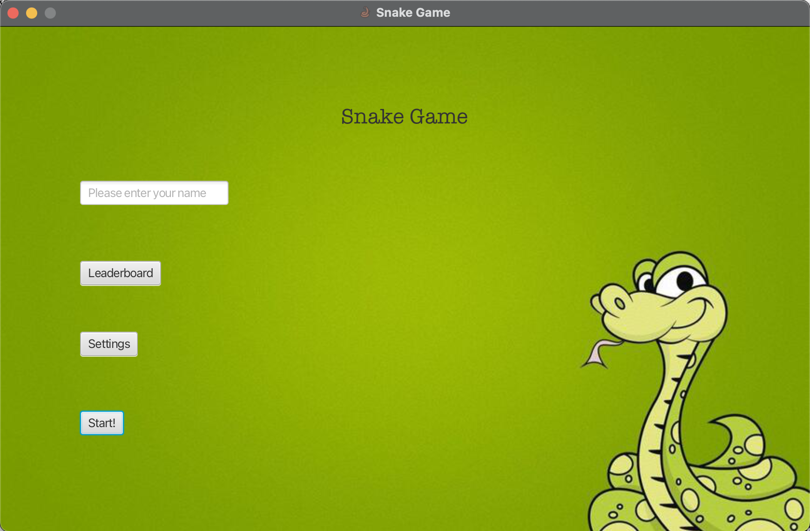
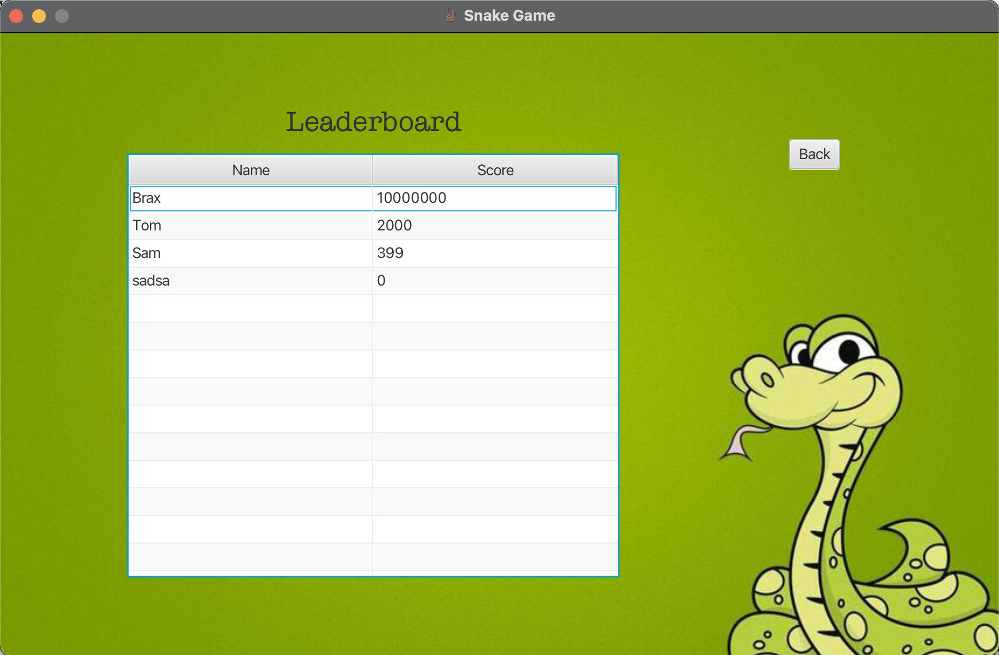
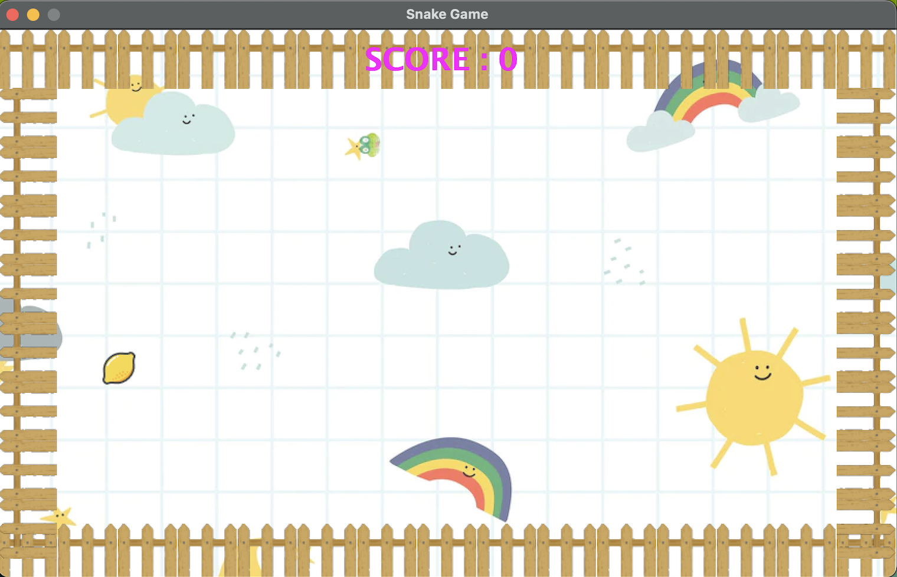

# Snake Game By Brax Wong

## Project Description

The main menu of the game consists of a text field that allows the user to enter his/her name,
a leaderboard button which transits to the leaderboard screen, a settings button that transits to the settings screen, and a start button that transits to the level selection screen.

 

On the leaderboard screen, a leaderboard will present players' names and scores.

In the settings screen, users are able to change the background and the snake head model. 
In the level selection screen, users are able to choose the difficulty of the game by selecting the radio button. 
When play is clicked, the game will start. In the playing field, there are fences that increase the difficulty of the game. 

If the snake makes contact with the fences, the game will end. 
When the game ends, the user will be presented the final score, which is located at the center of the screen. 

## How to run the project
To install the project, simply clone the repository to your local machine. Open your favorite code editor and run the project. You will have to link all the external library files from ExternalFlies package to the project structure in order to run the program. The main function is View_Menu, which is within the View package.

## How to play 
To move the snake upward, press the arrow keys to move the snake in respective directions. 
To grow the snake, move the snake to the food that spawns in randomized locations on the field. 
Your score will be increased by 10 points every time the snake consumes food. 
Beware of the fences! If the snake made contact with the borders or its body, the game would end. 
The game is too easy for you? No worries! You can increase the difficulty by selecting higher levels through the menu page.

## Credit
Special Thanks To:
Sigurður Sigurðardóttir for creating this version of the snake game
